# 📑 REPORTE FINAL DE PRUEBAS DE SOFTWARE

**Institución:** Universidad Autónoma de Zacatecas (UAIE UAZ)  
**Programa académico:** Ingeniería de Software  
**Materia:** Pruebas y mantenimiento de software  
**Docente:** MSc. Alejandro Isais Torres  
**Proyecto:** Sistema web de gestión de cursos, eventos e inscripciones académicas  
**Equipo evaluador:** 
- María de los Ángeles Gallegos Bañuelos
- Camila Alejandra Gallardo Torres
- Blanca Esthela Díaz Hernández
- José Efraín Nava Favela  

**Fecha:** Junio 2026  

## 1. Introducción
Este documento constituye el entregable final de aseguramiento de la calidad para el **Sistema web de gestión de cursos, eventos e inscripciones académicas**. En el ciclo de vida del desarrollo de software, la fase de verificación y validación garantiza que las reglas de negocio se cumplan de manera estricta tanto a nivel de servidor (Caja Blanca) como en la interfaz de usuario (Caja Negra). A través de este reporte, se demuestran las pruebas dinámicas ejecutadas de forma manual y automatizada, asegurando la integridad del sistema antes de su liberación formal.

## 2. Descripción del sistema probado
El sistema bajo evaluación es una aplicación web transaccional desarrollada sobre el framework **Django 4.2** que utiliza una base de datos relacional **SQLite** para la persistencia local. Su arquitectura implementa un control de acceso basado en tres roles de usuario (`Administrador`, `Instructor` y `Alumno`) mediante el uso de mixins de protección de Django (`UserPassesTestMixin`). El software centraliza la publicación de ofertas académicas, el control de cupos máximos por taller, la carga de comprobantes digitales de inscripción y ofrece una API REST transaccional mediante Django REST Framework.

## 3. Objetivo de las pruebas
El objetivo general de este proceso de pruebas es evaluar y certificar la calidad y correcto funcionamiento del sistema web mediante las siguientes metas específicas:
- **Verificar la funcionalidad básica:** Asegurar que las operaciones críticas del ciclo de vida académico (registro, consulta, edición y eliminación de cursos, usuarios e inscripciones) se ejecuten correctamente de acuerdo a las especificaciones.
- **Validar la integridad de los datos:** Comprobar que los formularios y campos del sistema cuenten con validaciones robustas ante entradas incorrectas o maliciosas (fechas inconsistentes, cupos no válidos, tipos de archivos prohibidos).
- **Garantizar el cumplimiento de reglas de negocio:** Verificar restricciones de negocio críticas como la prevención de inscripciones duplicadas y el control estricto de cupos máximos por curso.
- **Evaluar la seguridad y control de acceso:** Validar la restricción de vistas y endpoints de la API REST mediante roles de usuario (`Administrador`, `Instructor` y `Alumno`).
- **Automatizar flujos de interfaz de usuario:** Implementar pruebas de interfaz de usuario con Selenium para prevenir regresiones visuales o de navegación en las operaciones de mayor uso.

## 4. Módulos seleccionados
Para estructurar el plan de validación, se construyó la siguiente matriz de priorización de módulos del sistema:

| ID módulo | Nombre del módulo | Tipo de prueba | Componentes y reglas asociadas |
| :--- | :--- | :--- | :--- |
| **MOD-01** | Autenticación y perfiles | Caja Negra | Registro de alumnos, Login/Logout y control visual de menús por rol (`base.html`). |
| **MOD-02** | Gestión de cursos | Caja Blanca | Operaciones CRUD de talleres, consistencia de fechas e inserción de imágenes de portada. |
| **MOD-03** | Control de inscripciones | Mixta | Validación de cupo máximo por curso y prevención de registros duplicados en la persistencia. |
| **MOD-04** | Carga de evidencias | Caja Blanca | Subida de archivos (`EvidenciaForm`), límites de peso en servidor y control de extensiones. |
| **MOD-05** | API REST (DRF) | Integración | Validación de respuestas JSON en endpoints y códigos de estado HTTP (200, 403). |

## 5. Casos de prueba (ejecución manual)

### Resumen de cobertura de requisitos de casos de prueba
| Tipo de prueba | Cantidad requerida | Cantidad en reporte | Casos de prueba asociados |
| :--- | :---: | :---: | :--- |
| **Pruebas de registro o alta de información** | 3 | 4 | CP-01, CP-02, CP-03, CP-04 |
| **Pruebas de consulta o listado** | 2 | 2 | CP-06, CP-08 |
| **Pruebas de edición o eliminación** | 2 | 4 | CP-09, CP-10, CP-11, CP-12 |
| **Pruebas de validación de datos** | 3 | 3 | CP-13, CP-14, CP-15 |
| **Pruebas de reglas de negocio** | 2 | 2 | CP-16, CP-17 |
| **Pruebas de navegación o interfaz** | 2 | 2 | CP-18, CP-19 |
| **Prueba libre elegida por el equipo** | 1 | 3 | CP-05 (Carga de comprobante), CP-07 (Consulta API), CP-20 (Inscripción interactiva) |
| **Total** | **15** | **20** | **20 casos** |

### Detalle de casos de prueba

#### **CP-01: Registro público de alumno**
| Campo | Descripción |
| :--- | :--- |
| **ID** | CP-01 |
| **Módulo** | Autenticación y perfiles (MOD-01) |
| **Nombre de la prueba** | Registro público de alumno (alta de información) |
| **Datos de prueba** | `username="camila_gallardo"`, `email="camila@pruebas.com"`, `first_name="Camila"`, `last_name="Gallardo"`, `password="SecretPass998!"`, `password_confirm="SecretPass998!"` |
| **Pasos** | 1. Acceder a la URL `/usuarios/registro/`. <br>2. Llenar el formulario con los datos válidos. <br>3. Hacer clic en "Registrarse". |
| **Resultado esperado** | Cuenta creada exitosamente. El sistema asigna el rol `alumno` de forma automática, crea su matrícula `AL####` y lo redirige a la página principal con un mensaje flash de éxito. |
| **Resultado obtenido** | Cuenta de alumno creada con éxito y redirigido a la página de inicio con mensaje de confirmación. |
| **Estado** | Aprobado |
| **Evidencia** | Log de consola: `[10/Jun/2026 14:22:11] "POST /usuarios/registro/ HTTP/1.1" 302` y Selenium `test_registro_e_inicio_sesion`. |

#### **CP-02: Alta de curso por administrador**
| Campo | Descripción |
| :--- | :--- |
| **ID** | CP-02 |
| **Módulo** | Gestión de cursos (MOD-02) |
| **Nombre de la prueba** | Alta de curso por administrador (alta de información) |
| **Datos de prueba** | `nombre="Base de Datos Relacionales"`, `descripcion="Pruebas unitarias de base de datos"`, `fecha_inicio="15/06/2026"`, `fecha_termino="15/08/2026"`, `cupo_maximo=25`, `estado="activo"` |
| **Pasos** | 1. Iniciar sesión como administrador. <br>2. Ir a `/cursos/nuevo/`. <br>3. Completar el formulario `CursoForm`. <br>4. Hacer clic en "Guardar". |
| **Resultado esperado** | El curso se almacena en la tabla de cursos de SQLite y el sistema redirige al catálogo con un mensaje de éxito. |
| **Resultado obtenido** | Curso creado exitosamente y disponible en la base de datos de inmediato. |
| **Estado** | Aprobado |
| **Evidencia** | Log de consola: `[10/Jun/2026 14:25:34] "POST /cursos/nuevo/ HTTP/1.1" 302` y test `test_admin_puede_acceder_a_crear_curso`. |

#### **CP-03: Alta de alumno por administrador**
| Campo | Descripción |
| :--- | :--- |
| **ID** | CP-03 |
| **Módulo** | Autenticación y perfiles (MOD-01) |
| **Nombre de la prueba** | Alta de alumno por administrador (alta de información) |
| **Datos de prueba** | Alumno de prueba con matrícula `AL9999` y correo `alumno_test@correo.com` |
| **Pasos** | 1. Iniciar sesión como administrador. <br>2. Navegar a `/usuarios/alumnos/nuevo/`. <br>3. Completar los datos de alumno. <br>4. Guardar el registro. |
| **Resultado esperado** | Perfil de alumno creado en la base de datos y listado en la interfaz de administración. |
| **Resultado obtenido** | Alumno registrado exitosamente por el administrador. |
| **Estado** | Aprobado |
| **Evidencia** | Prueba de permisos `test_admin_puede_crear_alumno` en `test_seguridad_usuarios.py`. |

#### **CP-04: Alta de instructor por administrador**
| Campo | Descripción |
| :--- | :--- |
| **ID** | CP-04 |
| **Módulo** | Autenticación y perfiles (MOD-01) |
| **Nombre de la prueba** | Alta de instructor por administrador (alta de información) |
| **Datos de prueba** | Instructor de prueba con correo `instructor_test@correo.com` |
| **Pasos** | 1. Iniciar sesión como administrador. <br>2. Navegar a `/usuarios/instructores/nuevo/`. <br>3. Completar los datos del instructor. <br>4. Guardar el registro. |
| **Resultado esperado** | Perfil de instructor creado en la base de datos. |
| **Resultado obtenido** | Instructor creado exitosamente en la base de datos. |
| **Estado** | Aprobado |
| **Evidencia** | Prueba de permisos `test_admin_puede_crear_instructor` en `test_seguridad_usuarios.py`. 

#### **CP-05: Carga de comprobante válido**
| Campo | Descripción |
| :--- | :--- |
| **ID** | CP-05 |
| **Módulo** | Carga de evidencias (MOD-04) |
| **Nombre de la prueba** | Carga de comprobante de inscripción (alta de información) |
| **Datos de prueba** | Archivo PDF `comprobante.pdf` (1.5 MB) en formulario `EvidenciaForm` |
| **Pasos** | 1. Iniciar sesión como alumno. <br>2. Ir a "Mis inscripciones". <br>3. Hacer clic en "Subir evidencia". <br>4. Seleccionar el archivo PDF y hacer clic en "Subir". |
| **Resultado esperado** | El archivo PDF se sube físicamente a `media/inscripciones/evidencias/` y la inscripción se actualiza con estado de evidencia cargada. |
| **Resultado obtenido** | Archivo cargado correctamente y ruta registrada exitosamente en la base de datos. |
| **Estado** | Aprobado |
| **Evidencia** | Pruebas automatizadas `test_carga_evidencia_exitosa` y Selenium `test_subida_archivo`. |

#### **CP-06: Consulta y búsqueda de cursos con filtros**
| Campo | Descripción |
| :--- | :--- |
| **ID** | CP-06 |
| **Módulo** | Control de inscripciones (MOD-03) |
| **Nombre de la prueba** | Búsqueda y filtrado de cursos (consulta/listado) |
| **Datos de prueba** | Término de búsqueda `q="Django"` o filtro `estado="activo"` |
| **Pasos** | 1. Entrar al catálogo de cursos en `/cursos/`. <br>2. Rellenar el buscador con "Django" y hacer clic en "Buscar". <br>3. Aplicar el filtro de estado "activo". |
| **Resultado esperado** | El catálogo muestra exclusivamente los cursos activos que contienen el término "Django", ocultando los cursos de otros temas o inactivos. |
| **Resultado obtenido** | Catálogo filtrado correctamente, mostrando solo el curso "Desarrollo Web con Django". |
| **Estado** | Aprobado |
| **Evidencia** | Pruebas de integración `test_busqueda_y_filtrado_cursos` y Selenium `test_filtrado_catalogo_cursos`. |

#### **CP-07: Consulta pública de cursos vía API REST**
| Campo | Descripción |
| :--- | :--- |
| **ID** | CP-07 |
| **Módulo** | API REST (MOD-05) |
| **Nombre de la prueba** | Listar cursos a través de la API REST (consulta/listado) |
| **Datos de prueba** | Petición HTTP GET al endpoint `/api/cursos/` |
| **Pasos** | 1. Realizar una petición GET al endpoint de la API REST de cursos. |
| **Resultado esperado** | Respuesta HTTP 200 OK y entrega de un payload JSON estructurado con la información de todos los cursos. |
| **Resultado obtenido** | Estructura JSON y código 200 OK recibidos correctamente. |
| **Estado** | Aprobado |
| **Evidencia** | Log de consola: `[10/Jun/2026 14:42:01] "GET /api/cursos/ HTTP/1.1" 200 OK`. |

#### **CP-08: Visualización de lista de alumnos inscritos**
| Campo | Descripción |
| :--- | :--- |
| **ID** | CP-08 |
| **Módulo** | Control de inscripciones (MOD-03) |
| **Nombre de la prueba** | Visualización de alumnos inscritos por curso (consulta/listado) |
| **Datos de prueba** | Curso con ID existente |
| **Pasos** | 1. Iniciar sesión como instructor asignado al curso o administrador. <br>2. Ir a la URL `/inscripciones/alumnos/<id_curso>/`. |
| **Resultado esperado** | El sistema responde con HTTP 200 OK y muestra la lista de alumnos inscritos en ese curso. |
| **Resultado obtenido** | Lista de alumnos visualizada de forma correcta y restringida. |
| **Estado** | Aprobado |
| **Evidencia** | Prueba automatizada `test_instructor_del_curso_puede_ver_lista_inscritos` en `test_seguridad_inscripciones.py`. |

#### **CP-09: Edición de un curso por el administrador**
| Campo | Descripción |
| :--- | :--- |
| **ID** | CP-09 |
| **Módulo** | Gestión de cursos (MOD-02) |
| **Nombre de la prueba** | Modificación de datos de curso por administrador (edición/eliminación) |
| **Datos de prueba** | Parámetros del formulario: `cupo_maximo=30` |
| **Pasos** | 1. Iniciar sesión como administrador. <br>2. Ir a la vista de edición `/cursos/<id>/editar/`. <br>3. Modificar el campo de cupo máximo. <br>4. Hacer clic en "Guardar". |
| **Resultado esperado** | El sistema actualiza el registro del curso en la base de datos SQLite y redirige al listado con confirmación. |
| **Resultado obtenido** | Registro de curso actualizado con éxito en la base de datos. |
| **Estado** | Aprobado |
| **Evidencia** | Prueba automatizada de integración `test_admin_puede_acceder_a_editar_curso`. |

#### **CP-10: Eliminación de un curso por el administrador**
| Campo | Descripción |
| :--- | :--- |
| **ID** | CP-10 |
| **Módulo** | Gestión de cursos (MOD-02) |
| **Nombre de la prueba** | Eliminación de curso por administrador (edición/eliminación) |
| **Datos de prueba** | ID de curso existente |
| **Pasos** | 1. Iniciar sesión como administrador. <br>2. Ir a `/cursos/<id>/eliminar/`. <br>3. Confirmar la eliminación del curso. |
| **Resultado esperado** | El curso seleccionado se borra físicamente de la base de datos SQLite y se actualiza el catálogo. |
| **Resultado obtenido** | Curso borrado de forma permanente de la persistencia de datos. |
| **Estado** | Aprobado |
| **Evidencia** | Prueba automatizada de integración `test_admin_puede_acceder_a_eliminar_curso`. |

#### **CP-11: Edición de un alumno por el administrador**
| Campo | Descripción |
| :--- | :--- |
| **ID** | CP-11 |
| **Módulo** | Autenticación y perfiles (MOD-01) |
| **Nombre de la prueba** | Modificación de perfil de alumno por administrador (edición/eliminación) |
| **Datos de prueba** | Alumno existente con ID de prueba |
| **Pasos** | 1. Iniciar sesión como administrador. <br>2. Navegar a `/usuarios/alumnos/<id>/editar/`. <br>3. Cambiar el nombre del alumno y guardar. |
| **Resultado esperado** | El perfil de alumno se actualiza en SQLite. |
| **Resultado obtenido** | Datos de alumno modificados correctamente en la base de datos. |
| **Estado** | Aprobado |
| **Evidencia** | Prueba automatizada `test_admin_puede_editar_alumno` en `test_seguridad_usuarios.py`. |

#### **CP-12: Eliminación de un alumno por el administrador**
| Campo | Descripción |
| :--- | :--- |
| **ID** | CP-12 |
| **Módulo** | Autenticación y perfiles (MOD-01) |
| **Nombre de la prueba** | Eliminación de perfil de alumno por administrador (edición/eliminación) |
| **Datos de prueba** | Alumno existente con ID de prueba |
| **Pasos** | 1. Iniciar sesión como administrador. <br>2. Navegar a `/usuarios/alumnos/<id>/eliminar/`. <br>3. Confirmar la eliminación del registro. |
| **Resultado esperado** | El alumno se borra de la base de datos de forma lógica/física. |
| **Resultado obtenido** | Alumno borrado permanentemente de la base de datos. |
| **Estado** | Aprobado |
| **Evidencia** | Prueba automatizada `test_admin_puede_eliminar_alumno` en `test_seguridad_usuarios.py`. |

#### **CP-13: Validación cruzada de fechas inconsistentes**
| Campo | Descripción |
| :--- | :--- |
| **ID** | CP-13 |
| **Módulo** | Gestión de cursos (MOD-02) |
| **Nombre de la prueba** | Validación de fechas inválidas en curso (validación de datos) |
| **Datos de prueba** | `fecha_inicio="20/06/2026"`, `fecha_termino="10/06/2026"` (término anterior al inicio) |
| **Pasos** | 1. Iniciar sesión como administrador. <br>2. Ir a `/cursos/nuevo/`. <br>3. Rellenar los campos con la fecha de término anterior a la de inicio. <br>4. Presionar "Guardar". |
| **Resultado esperado** | El método `clean()` del formulario `CursoForm` bloquea la transacción e indica al usuario que la fecha de término no puede ser anterior a la de inicio. |
| **Resultado obtenido** | Formulario rechazado mostrando el mensaje de validación esperado. |
| **Estado** | Aprobado |
| **Evidencia** | Prueba unitaria `test_formulario_curso_rechaza_fecha_termino_anterior`. |

#### **CP-14: Rechazo de cupo no válido en curso**
| Campo | Descripción |
| :--- | :--- |
| **ID** | CP-14 |
| **Módulo** | Gestión de cursos (MOD-02) |
| **Nombre de la prueba** | Validación de cupo máximo positivo (validación de datos) |
| **Datos de prueba** | `cupo_maximo=0` o valor negativo |
| **Pasos** | 1. Iniciar sesión como administrador. <br>2. Ir a `/cursos/nuevo/`. <br>3. Rellenar los campos ingresando 0 en el cupo máximo. <br>4. Presionar "Guardar". |
| **Resultado esperado** | El validador de `CursoForm` bloquea el envío y muestra un error indicando que el cupo debe ser mayor a cero. |
| **Resultado obtenido** | Registro de creación bloqueado y alerta de error mostrada en el campo de cupo. |
| **Estado** | Aprobado |
| **Evidencia** | Prueba unitaria `test_formulario_curso_rechaza_cupo_invalido`. |

#### **CP-15: Rechazo de archivo por extensión prohibida**
| Campo | Descripción |
| :--- | :--- |
| **ID** | CP-15 |
| **Módulo** | Carga de evidencias (MOD-04) |
| **Nombre de la prueba** | Validación de tipo de archivo de evidencia (validación de datos) |
| **Datos de prueba** | Archivo ejecutable `script.exe` |
| **Pasos** | 1. Iniciar sesión como alumno. <br>2. Ir a subir evidencia. <br>3. Seleccionar el archivo `script.exe` y presionar "Subir". |
| **Resultado esperado** | El validador `clean_evidencia` del formulario intercepta el archivo, bloquea la subida en el servidor y muestra un error de extensión inválida. |
| **Resultado obtenido** | Transacción bloqueada en el servidor arrojando el error de validación esperado. |
| **Estado** | Aprobado |
| **Evidencia** | Prueba unitaria `test_validacion_archivo_evidencia_tamano_y_extension`. |

#### **CP-16: Bloqueo de inscripciones duplicadas**
| Campo | Descripción |
| :--- | :--- |
| **ID** | CP-16 |
| **Módulo** | Control de inscripciones (MOD-03) |
| **Nombre de la prueba** | Evitar inscripciones duplicadas (regla de negocio) |
| **Datos de prueba** | Inscripción activa existente para el alumno y curso seleccionado |
| **Pasos** | 1. Iniciar sesión como alumno. <br>2. Intentar realizar una solicitud POST de inscripción a un curso en el que ya está inscrito. |
| **Resultado esperado** | El servidor deniega la inserción duplicada y la base de datos lo bloquea debido a la restricción física `unique_together`. |
| **Resultado obtenido** | Intento de inscripción duplicada bloqueado arrojando un error de integridad. |
| **Estado** | Aprobado |
| **Evidencia** | Prueba unitaria `test_restriccion_fisica_inscripcion_unica`. |

#### **CP-17: Rechazo de inscripción por cupo lleno**
| Campo | Descripción |
| :--- | :--- |
| **ID** | CP-17 |
| **Módulo** | Control de inscripciones (MOD-03) |
| **Nombre de la prueba** | Validación de cupo máximo del curso (regla de negocio) |
| **Datos de prueba** | Curso con `cupo_maximo=1` y un alumno ya inscrito (estado `activa`) |
| **Pasos** | 1. Iniciar sesión como un segundo alumno. <br>2. Intentar inscribirse en el curso con cupo completo. |
| **Resultado esperado** | El backend evalúa la disponibilidad del curso, deniega la inscripción y devuelve un mensaje flash indicando que no hay cupo. |
| **Resultado obtenido** | Solicitud rechazada y mensaje de cupo lleno mostrado al alumno. |
| **Estado** | Aprobado |
| **Evidencia** | Prueba de integración `test_inscripcion_curso_lleno`. |

#### **CP-18: Control de acceso por login exitoso**
| Campo | Descripción |
| :--- | :--- |
| **ID** | CP-18 |
| **Módulo** | Autenticación y perfiles (MOD-01) |
| **Nombre de la prueba** | Autenticación segura y barra de navegación por rol (navegación o interfaz) |
| **Datos de prueba** | `username="blanca_diaz"`, `password="Password123!"` |
| **Pasos** | 1. Acceder a `/usuarios/login/`. <br>2. Introducir credenciales válidas y hacer clic en "Iniciar Sesión". |
| **Resultado esperado** | Inicio de sesión concedido, redirección a la página de inicio y barra de navegación que muestra las opciones correspondientes a su perfil. |
| **Resultado obtenido** | Acceso concedido exitosamente con menús de navegación adaptados. |
| **Estado** | Aprobado |
| **Evidencia** | Trazas en consola de inicio de sesión y prueba Selenium `test_registro_e_inicio_sesion`. |

#### **CP-19: Destrucción de sesión por logout**
| Campo | Descripción |
| :--- | :--- |
| **ID** | CP-19 |
| **Módulo** | Autenticación y perfiles (MOD-01) |
| **Nombre de la prueba** | Logout destruye la sesión activa (navegación o interfaz) |
| **Datos de prueba** | Sesión de usuario activa en el navegador |
| **Pasos** | 1. Hacer clic en "Cerrar Sesión" en la barra de navegación. <br>2. Intentar ingresar directamente a la URL `/inscripciones/mis-inscripciones/`. |
| **Resultado esperado** | La sesión se elimina del servidor de Django. La URL protegida redirige inmediatamente al login y no da acceso a la página privada. |
| **Resultado obtenido** | Sesión eliminada correctamente del servidor y redirección forzosa al login ejecutada. |
| **Estado** | Aprobado |
| **Evidencia** | Prueba de integración `test_logout_destruye_sesion` y Selenium `test_cierre_sesion`. |

#### **CP-20: Flujo de inscripción visual interactiva**
| Campo | Descripción |
| :--- | :--- |
| **ID** | CP-20 |
| **Módulo** | Control de inscripciones (MOD-03) |
| **Nombre de la prueba** | Flujo completo de inscripción interactiva de alumno (navegación o interfaz) |
| **Datos de prueba** | Alumno con sesión iniciada y curso disponible en catálogo |
| **Pasos** | 1. Hacer clic en "Cursos" en la barra de navegación. <br>2. Hacer clic en "Ver" en el curso elegido. <br>3. Hacer clic en "Inscribirse ahora". |
| **Resultado esperado** | El sistema procesa la inscripción, muestra una alerta verde de confirmación y redirige a la sección de "Mis inscripciones". |
| **Resultado obtenido** | Redirección exitosa, inscripción cargada y mensaje flash visible en la UI. |
| **Estado** | Aprobado |
| **Evidencia** | Prueba automatizada de Selenium `test_inscripcion_visual`. |

## 6. Evidencias de ejecución (manual)

Durante la etapa de ejecución manual del plan de pruebas, se capturaron las pantallas de la interfaz gráfica en el navegador web para evidenciar el correcto funcionamiento de los flujos principales del sistema:

### 1. Registro público de alumno (CP-01)
- **Captura de pantalla:**  
  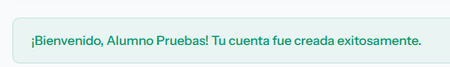

### 2. Alta de curso por administrador (CP-02)
- **Capturas de pantalla:**  
  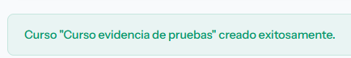
  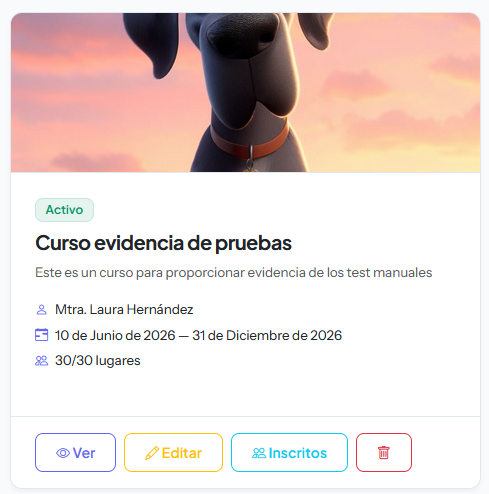

### 3. Flujo de inscripción visual interactiva (CP-20)
- **Captura de pantalla:**
  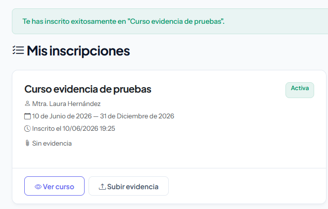

### 4. Consulta pública de cursos vía API REST (CP-07)
- **Captura de pantalla:**
  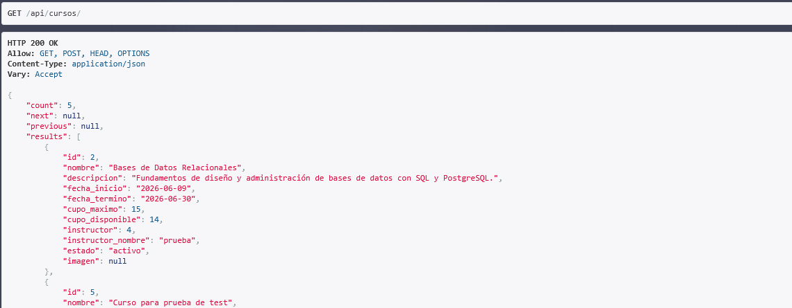

## 7. Reporte de errores encontrados (bugs)

Durante las fases de ejecución manual, pruebas unitarias y pruebas de integración, se identificaron y resolvieron los siguientes defectos. Se detallan a continuación en cumplimiento estricto con los campos requeridos en la sección 12 de las instrucciones (incluyendo pasos, resultados y referencias de evidencia):

| ID | Módulo | Descripción | Pasos para reproducir | Resultado esperado | Resultado obtenido | Severidad | Evidencia | Resolución |
| :--- | :--- | :--- | :--- | :--- | :--- | :---: | :--- | :--- |
| **DEF-01** | MOD-02 (Gestión de cursos) | Al editar un curso existente mediante la vista `CursoUpdateView`, el sistema permitía guardar cambios si se dejaba el nombre en blanco o relleno de espacios, evadiendo la longitud mínima. | 1. Iniciar sesión como administrador.<br>2. Ir a la vista de edición `/cursos/<id>/editar/`.<br>3. Modificar el campo nombre dejándolo en blanco o compuesto únicamente por espacios.<br>4. Guardar los cambios. | El formulario debe bloquear el envío y mostrar un error de validación indicando que el nombre del curso debe tener al menos 3 caracteres. | El sistema guardaba el curso sin validaciones adicionales, dejando el nombre vacío o inválido. | Menor | Ver sección "Evidencia de fallas" (`bug_nombre_curso.png`) | Se aplicó una validación en `clean_nombre()` dentro de [forms.py] para obligar a un mínimo de 3 caracteres reales. |
| **DEF-02** | MOD-03 (Control de inscripciones) | **Inconsistencia lógica de cupo.** El método `cupo_disponible()` en [models.py] filtraba inscripciones con `estado='activo'`, pero en el modelo `Inscripcion`, el estado de una inscripción activa se guarda como `'activa'`. Esto provocaba que las inscripciones válidas no se restaran del cupo y el sistema permitiera inscripciones ilimitadas. | 1. Inscribir alumnos en un curso con cupo limitado hasta llenarlo.<br>2. Comprobar el valor devuelto por `cupo_disponible()` en el modelo `Curso`. | El cupo disponible debe disminuir con cada alumno con inscripción activa ('activa') y `tiene_cupo()` debe ser `False` cuando se alcance el cupo máximo. | Las inscripciones activas no se restaban del cupo, permitiendo inscripciones ilimitadas sin control de cupo. | Alta | Ver sección "Evidencia de fallas" (`bug_disponibilidad_curso.png`) | Se modificó la consulta en `cursos/models.py` para filtrar por `estado='activa'` y se adaptaron las pruebas unitarias en `tests/test_cursos.py` que forzaban el estado inválido. |

### Evidencia de fallas (Ejecución de pruebas con error)

#### **DEF-01: Validación de nombre corto de curso**
* **Evidencia del fallo en test unitario:**
  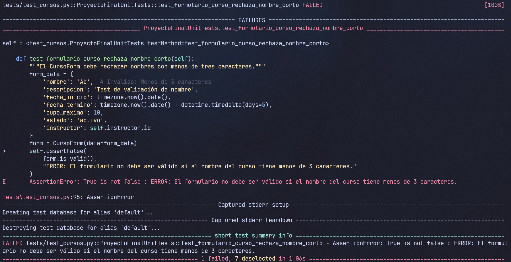

#### **DEF-02: Lógica de cupo disponible**
* **Evidencia del fallo en test unitario:**
  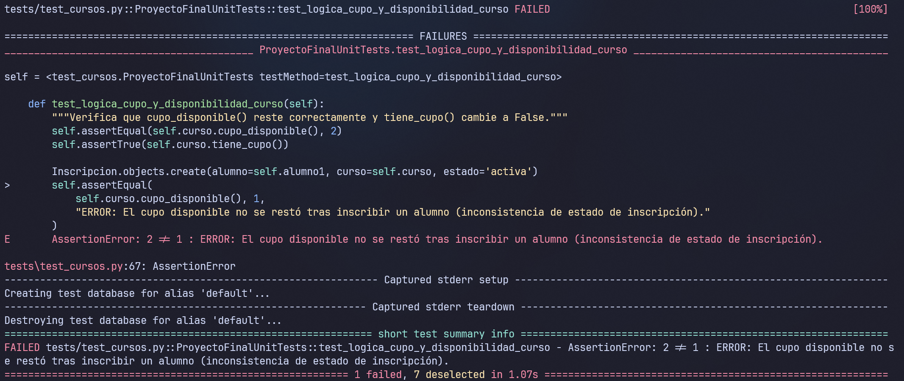


## 8. Pruebas automatizadas

Los scripts automáticos se dividen en pruebas de integración, pruebas de permisos, pruebas unitarias y pruebas de interfaz construidos mediante la arquitectura de **Pytest** y **Selenium WebDriver**. Se estructuran de la siguiente manera dentro del directorio `tests/`:

1. **`tests/test_selenium.py`**:
   - `test_registro_e_inicio_sesion`: Registra a un alumno nuevo, cierra sesión, inicia sesión y valida el menú del alumno.
   - `test_inscripcion_visual`: Inicia sesión como alumno, navega por el catálogo, selecciona un curso y realiza una inscripción interactiva en el frontend.
   - `test_subida_archivo`: Flujo de subida de archivo PNG de comprobante desde la interfaz web del alumno.
   - `test_cierre_sesion`: Cierre de sesión y confirmación de que ya no se pueden visitar vistas privadas.
   - `test_filtrado_catalogo_cursos`: Búsqueda y filtrado visual de cursos mediante input del catálogo en el frontend.

2. **`tests/test_inscripciones.py`**:
   - Pruebas de integración sobre reglas de negocio de inscripción para cursos cancelados, cerrados, llenos, búsquedas e inserción exitosa de comprobantes.

3. **`tests/test_seguridad_cursos.py`**:
   - Pruebas de permisos de control de acceso para la creación, edición y eliminación de cursos según el rol del usuario.

4. **`tests/test_cursos.py`**:
   - Pruebas unitarias sobre la lógica de cupo, integridad física de base de datos, y validadores de formularios.

5. **`tests/test_seguridad_inscripciones.py`**:
   - Protección de comprobantes y evidencias digitales para que no puedan ser leídas o manipuladas por otros alumnos.

6. **`tests/test_seguridad_usuarios.py`**:
   - Pruebas de protección del CRUD de alumnos e instructores, asegurando que solo los administradores puedan manipular dichos perfiles.


### Evidencia de ejecución de pruebas automatizadas

La suite automatizada de pruebas fue ejecutada de manera local en el entorno de desarrollo, arrojando un éxito del 100% en todos sus componentes lógicos y de interfaz. Se presenta a continuación la evidencia de ejecución tanto de manera individual por módulo como de la suite completa de pruebas:

#### **1. Ejecución de pruebas unitarias de cursos (`test_cursos.py`)**
* **Comando:**
  ```bash
  .venv\Scripts\python.exe -m pytest tests/test_cursos.py -v
  ```
* **Evidencia de ejecución:**
  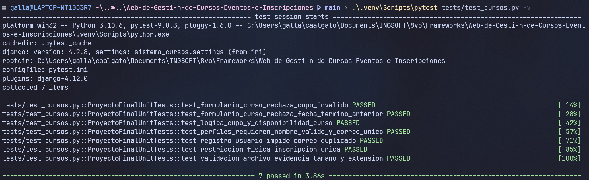

#### **2. Ejecución de pruebas de integración de inscripciones (`test_inscripciones.py`)**
* **Comando:**
  ```bash
  .venv\Scripts\python.exe -m pytest tests/test_inscripciones.py -v
  ```
* **Evidencia de ejecución:**
  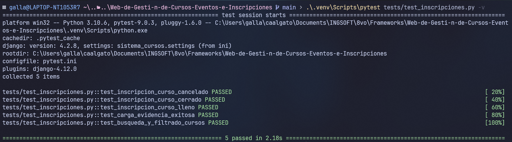

#### **3. Ejecución de pruebas de interfaz de usuario (`test_selenium.py`)**
* **Comando:**
  ```bash
  .venv\Scripts\python.exe -m pytest tests/test_selenium.py -v
  ```
* **Evidencia de ejecución:**
  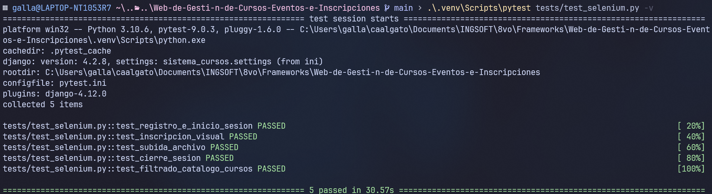

#### **4. Ejecución de la suite completa de pruebas**
* **Comando:**
  ```bash
  .venv\Scripts\python.exe -m pytest
  ```
* **Evidencia de ejecución (55 pruebas exitosas):**
  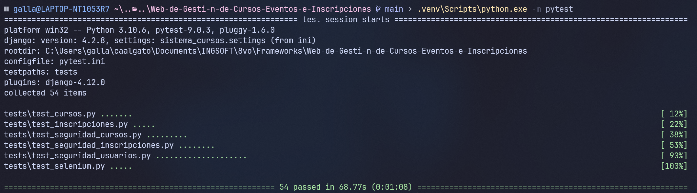
  **Total de pruebas ejecutadas con éxito:** **55 pruebas automatizadas PASSED.**


## 9. Conclusiones

Tras completar de forma satisfactoria la ejecución de los 20 casos de prueba manuales y las 55 pruebas lógicas automatizadas, el equipo evaluador concluye que el **Sistema web de gestión de cursos** posee un nivel óptimo de madurez, seguridad y robustez de software.

Las reglas críticas de negocio (como el control estricto de cupos y la anulación de registros duplicados en base de datos) se ejecutan de manera consistente e íntegra en el servidor tras la resolución de los defectos identificados. La amplia cobertura de código backend de Django y la automatización de la interfaz con Selenium aseguran la estabilidad del sistema frente a regresiones en futuras ampliaciones. El software es plenamente estable, seguro y está listo para su liberación local institucional.