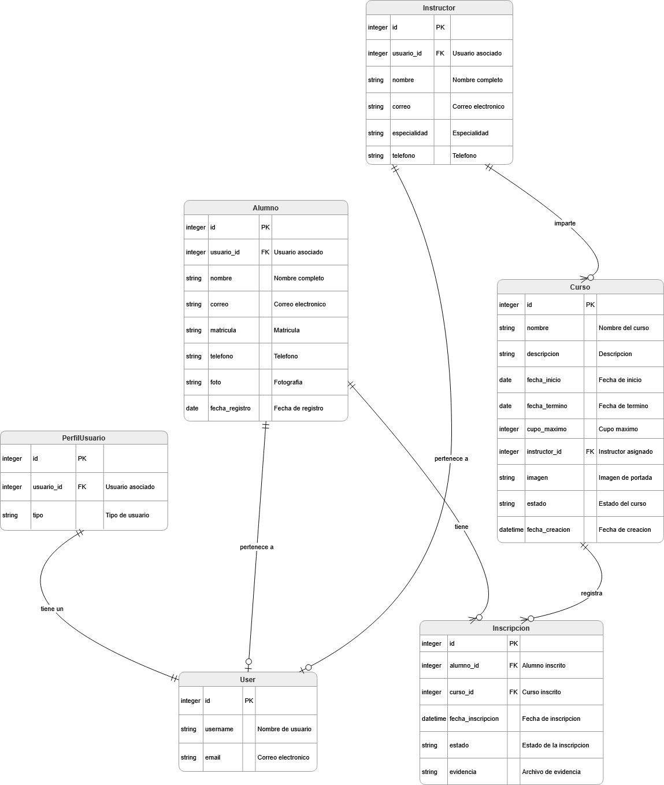

# UNIVERSIDAD AUTÓNOMA DE ZACATECAS
### Unidad Académica de Ingeniería Eléctrica
### Ingeniería de Software

---

## Sistema Web de Gestión de Cursos, Eventos e Inscripciones Académicas
*Documento Final de Proyecto*

---

### Integrantes del equipo:
* María de los Ángeles Gallegos Bañuelos
* Camila Alejandra Gallardo Torres
* Blanca Esthela Díaz Hernández
* José Efraín Nava Favela

**Materia:** Programación Delphi
**Fecha:** Junio 2026

---

# 1. Introducción
Este documento detalla el Sistema Web de Gestión de cursos, Eventos e Inscripciones Académicas, una aplicación web construida con Django 4.2 y Django REST Framework como proyecto final de la materia de Programación Delphi.

El proyecto responde a la necesidad de una institucion educativa de digitalizar y centralizar la administracion de sus cursos y eventos académicos, eliminando procesos manuales propensos a errores. La plataforma permite registrar usuarios con distintos roles, administrar cursos, gestionar inscripciones con validacion de cupo y duplicados, subir evidencias de participacion y consumir datos mediante una API REST.

# 2. Planteamiento del problema
Una institucion educativa que imparte cursos y eventos de formacion académica realiza actualmente sus procesos de inscripción de manera manual, utilizando hojas de calculo y registros en papel. Esta situacion genera los siguientes problemas:

- Perdida de informacion: los registros fisicos se deterioran, se extravían o se duplican.
- Duplicidad de inscripciones: un alumno puede registrarse varias veces al mismo curso sin que exista un mecanismo automático de validacion.
- Dificultad de consulta: no hay una forma rápida de saber cuántos alumnos están inscritos en un curso, quien los imparte o cual es el estado actual de cada evento.
- Falta de trazabilidad: no se cuenta con evidencia digital que respalde la participacion de los alumnos.
- Ausencia de control de cupo: los cursos pueden sobrepasar su capacidad máxima sin que el sistema lo impida.

La solucion propuesta es una aplicacion web centralizada que automatice el registro, la inscripción y la consulta de informacion académica, garantizando la integridad de los datos mediante validaciones en el servidor y reglas de negocio claras.

# 3. Objetivo general
Desarrollar una aplicacion web funcional utilizando Django 4.2 y Django REST Framework que integre modelos relacionales, vistas basadas en clases, formularios con validaciones personalizadas, autenticación de usuarios con roles, manejo de archivos y una API REST, con el fin de centralizar y automatizar la gestion de cursos, eventos e inscripciones académicas de una institucion educativa.

# 4. Objetivos específicos
1. Implementar un sistema de autenticación con tres roles de usuario: Administrador, Instructor y Alumno, utilizando el modelo de autenticación nativo de Django extendido con PerfilUsuario.
2. Crear el modulo de gestion de cursos con operaciones CRUD completas (crear, consultar, editar y eliminar), restringidas al rol de administrador, incluyendo carga de imagenes asociadas.
3. Desarrollar el modulo de inscripciones con validaciones de cupo máximo, estado del curso e inscripciones duplicadas, permitiendo ademas la carga de evidencias o comprobantes por parte del alumno.
4. Implementar vistas basadas en clases (ListView, DetailView, CreateView, UpdateView, DeleteView) para al menos el modulo de cursos.
5. Disenar formularios personalizados con ModelForms que incluyan validaciones propias en campos como nombre, correo, cupo máximo, fechas y archivos.
6. Exponer una API REST con Django REST Framework que permita realizar operaciones CRUD sobre cursos, alumnos, inscripciones e instructores, utilizando ViewSets y serializers.
7. Proveer una interfaz web responsiva construida con Bootstrap 5.3 que permita a los usuarios localizar cualquier funcionalidad en menos de 20 segundos.

# 5. Alcance del sistema
El sistema abarca los siguientes modulos y funcionalidades dentro de un entorno de ejecucion local:

- Gestion de usuarios: registro público exclusivo para alumnos (decisión de seguridad: no se permite elegir rol en el registro), inicio y cierre de sesión, vista de perfil. Los roles instructor y administrador los asigna el administrador.
- Gestion de alumnos e instructores: CRUD completo restringido a administradores. Al crear un instructor, el admin registra en un solo paso la ficha académica y la cuenta de acceso (`User` + `PerfilUsuario` + `Instructor`). Fotografía opcional solo en alumnos.
- Gestion de cursos: CRUD con imagen opcional, estado (activo, cerrado, cancelado), cupo máximo e instructor asignado; restringido a administradores. Vista web **Mis cursos** para instructores.
- Inscripciones: inscripción del alumno, mis inscripciones y evidencias; CRUD web de inscripciones para administradores (`/inscripciones/gestion/`); API REST sin cambios.
- Evidencias: carga de archivos PDF, imagenes o documentos Word como comprobante de inscripción.
- Búsqueda y filtrado: por nombre de curso, instructor y estado.
- API REST: endpoints para cursos, alumnos, inscripciones e instructores con autenticación por sesion.
- Navegación por rol en la barra principal: **Mis Inscripciones** solo para alumnos; **Mis Cursos** solo para instructores; menú **Administrar** solo para administradores.

Queda fuera del alcance de este proyecto: el despliegue en servidores de produccion, la integracion con sistemas de pago, la generacion automatica de certificados y el envio de correos electronicos.

# 6. Usuarios del sistema
| Rol | Descripción | Capacidades principales |
| --- | --- | --- |
| **Administrador** | Usuario con acceso total al sistema. | CRUD web de cursos, alumnos, instructores e inscripciones. Menú **Administrar** y `/admin/`. No se auto-inscribe a cursos (usa gestión de inscripciones). |
| **Instructor** | Docente que imparte uno o más cursos. | **Mis cursos** (`/cursos/mis-cursos/`), detalle del curso y alumnos inscritos. No se auto-inscribe a cursos. |
| **Alumno** | Estudiante que se inscribe a cursos. | Registro público, **Mis Inscripciones**, inscripción en línea en el detalle del curso y carga de evidencias. |

# 7. Requerimientos funcionales
| ID | Nombre | Descripción |
| --- | --- | --- |
| RF01 | Registro de usuarios | El registro público permite crear cuenta con nombre, apellidos, correo, usuario y contrasena. Por seguridad, el rol se asigna siempre como alumno (no hay selector de tipo en el formulario). El PDF sugiere tipo de usuario en registro; esta implementación lo restringe para evitar auto-registro como instructor o administrador. |
| RF02 | Inicio y cierre de sesion | Los usuarios registrados pueden autenticarse y cerrar sesion. |
| RF03 | Gestion de alumnos | CRUD completo de alumnos (lista, crear, editar, eliminar) restringido a administradores, con validaciones de correo único y nombre minimo. |
| RF04 | Gestion de instructores | CRUD completo restringido a administradores. Al crear, el formulario incluye usuario y contraseña; el sistema genera `User`, `PerfilUsuario` (tipo instructor) e `Instructor` vinculados en una transacción. Al editar, sincroniza correo y nombre con la cuenta. Al eliminar, borra también la cuenta de acceso si existe. |
| RF05 | Gestion de cursos | CRUD de cursos restringido a administradores; incluye carga de imagen, estado y cupo máximo. |
| RF06 | Consulta de cursos | Los alumnos ven lista de cursos disponibles con búsqueda y filtrado. |
| RF07 | Inscripción a cursos | Solo usuarios con rol **alumno** pueden inscribirse en línea a un curso activo con cupo disponible. Administradores e instructores no usan este flujo. |
| RF08 | Validacion de cupo | El sistema rechaza inscripciones cuando el curso alcanzo su cupo máximo. |
| RF09 | Evitar duplicados | Un mismo alumno no puede inscribirse dos veces al mismo curso. |
| RF10 | Carga de evidencia | El alumno puede subir un archivo (PDF, imagen, Word) como comprobante de inscripción. |
| RF11 | Lista de inscritos | Administradores e instructores consultan la lista de alumnos inscritos por curso. |
| RF12 | Búsqueda y filtrado | Búsqueda de cursos por nombre, nombre de instructor y estado. |
| RF13 | Validaciones en formularios | Nombre minimo 3 caracteres, correo único, cupo > 0, fecha termino >= inicio, tamano máximo de archivos. |
| RF14 | Mensajes al usuario | Mensajes de éxito, error o advertencia tras cada operacion CRUD o inscripción. |
| RF15 | Proteccion de vistas | Inscripción en línea y evidencia: solo alumnos autenticados. CRUD web de cursos, alumnos, instructores e inscripciones: solo administrador. **Mis cursos** e inscritos por curso: instructor asignado o admin. Menú de navegación acorde al rol. |
| RF16 | API REST | Endpoints GET, POST, PUT, PATCH, DELETE para cursos, alumnos, inscripciones e instructores. |

# 8. Requerimientos no funcionales
| ID | Nombre | Descripción |
| --- | --- | --- |
| RNF01 | Usabilidad | La interfaz con Bootstrap 5.3 permite localizar cualquier funcionalidad en menos de 20 segundos. |
| RNF02 | Seguridad | Vistas sensibles protegidas con @login_required y UserPassesTestMixin según el rol. |
| RNF03 | Integridad de datos | Validaciones en formularios y serializers evitan registros duplicados e informacion inválida. |
| RNF04 | Mantenibilidad | Código organizado en apps (usuarios, cursos, inscripciones) con modelos, vistas, formularios, URLs y serializers separados. |
| RNF05 | Escalabilidad | Arquitectura de apps independientes permite agregar nuevos modulos (pagos, certificados, reportes) sin reestructurar el proyecto. |
| RNF06 | Rendimiento | Las consultas principales responden en menos de 15 segundos para volúmenes pequeños o medianos con SQLite. |
| RNF07 | Compatibilidad | Funciona en entorno local con Python 3.10+, Django 4.2, SQLite y cualquier SO que soporte Python. |
| RNF08 | Legibilidad del código | Docstrings en clases y funciones clave; comentarios inline en validaciones críticas. |

# 9. Reglas de negocio
Las siguientes reglas son enforced tanto en la capa de vistas como en la API REST:

1. Un alumno no puede inscribirse dos veces al mismo curso. (Restriccion unique_together en el modelo Inscripción.)
2. Un curso no puede aceptar más alumnos que su cupo máximo. (Metodo tiene_cupo() en el modelo Curso.)
3. Un curso cancelado o cerrado no permite nuevas inscripciones. (Validacion de estado antes de crear inscripción en vistas y serializers.)
4. La fecha de término debe ser posterior o igual a la fecha de inicio. (Implementado en CursoForm.clean() y CursoSerializer.validate().)
5. Solo usuarios con rol alumno pueden inscribirse a cursos. (Vista `inscribirse` verifica `perfil.es_alumno()`; el detalle del curso muestra el botón solo a alumnos.)
6. Solo administradores o el instructor asignado al curso pueden consultar la lista completa de alumnos inscritos.
7. Solo administradores pueden crear, editar o eliminar cursos. (UserPassesTestMixin con perfil.es_admin().)

# 10. Modelo de datos
El sistema usa SQLite y define cinco entidades principales mapeadas como modelos Django. Se describe cada entidad con sus campos:

## 10.1 Entidad: Perfil de usuario
| Campo | Tipo | Descripción |
| --- | --- | --- |
| usuario | OneToOneField (User) | Relación 1:1 con el usuario de Django Auth |
| **tipo** | CharField (choices) | Rol: alumno, instructor o admin |

## 10.2 Entidad: Alumno
| Campo | Tipo | Descripción |
| --- | --- | --- |
| usuario | OneToOneField (User) | Relación opcional con usuario de Django Auth |
| **nombre** | CharField(150) | Nombre completo del alumno |
| **correo** | EmailField (unique) | Correo electrónico único |
| **matricula** | CharField(20, unique) | Clave de identificación institucional |
| **telefono** | CharField(15, blank) | Número de contacto opcional |
| **foto** | ImageField (blank) | Fotografía del alumno (almacenada en media/miembros/) |
| **fecha_registro** | DateField (auto) | Fecha en que se registró en el sistema |

## 10.3 Entidad: Instructor
| Campo | Tipo | Descripción |
| --- | --- | --- |
| usuario | OneToOneField (User) | Cuenta de acceso vinculada (creada por el admin al dar de alta) |
| **nombre** | CharField(150) | Nombre completo del instructor |
| **correo** | EmailField (unique) | Correo electrónico único |
| **especialidad** | CharField(200) | Área de conocimiento del instructor |
| **telefono** | CharField(15, blank) | Número de contacto opcional |

## 10.4 Entidad: Curso
| Campo | Tipo | Descripción |
| --- | --- | --- |
| **nombre** | CharField(200) | Nombre del curso o evento |
| **descripción** | TextField | Descripción detallada del contenido |
| **fecha_inicio** | DateField | Fecha de inicio del curso |
| **fecha_termino** | DateField | Fecha de conclusión (>= fecha_inicio) |
| **cupo_maximo** | PositiveIntegerField | Número máximo de alumnos permitidos |
| **instructor** | ForeignKey (Instructor) | Instructor responsable (NULL si se elimina el instructor) |
| **imagen** | ImageField (blank) | Imagen o portada del curso (media/cursos/imagenes/) |
| **estado** | CharField (choices) | Estado: activo, cerrado o cancelado |
| **fecha_creacion** | DateTimeField (auto) | Marca de tiempo de creación automatica |

## 10.5 Entidad: Inscripción
| Campo | Tipo | Descripción |
| --- | --- | --- |
| alumno | ForeignKey (Alumno) | Alumno que se inscribe |
| curso | ForeignKey (Curso) | Curso al que se inscribe |
| **fecha_inscripcion** | DateTimeField (auto) | Marca de tiempo automatica al crear el registro |
| **estado** | CharField (choices) | Estado de la inscripción: activa, cancelada o completada |
| **evidencia** | FileField (blank) | Archivo comprobante subido por el alumno (media/inscripciones/evidencias/) |

Restriccion de integridad: unique_together = ('alumno', 'curso') impide inscripciones duplicadas a nivel de base de datos (RF09).

# 11. Diagrama entidad-relación
El siguiente diagrama muestra las entidades principales del sistema y sus relaciones:

Relaciones implementadas:

- User (Django Auth) 1:1 PerfilUsuario  --  Cada usuario tiene exactamente un perfil con rol.
- User 1:1 Alumno  --  Un usuario de tipo alumno tiene un perfil de alumno con información académica.
- User 1:1 Instructor  --  Un usuario de tipo instructor tiene un perfil de instructor.
- Instructor 1:N Curso  --  Un instructor puede impartir muchos cursos; un curso tiene como máximo un instructor asignado.
- Alumno N:M Curso (mediante Inscripción)  --  Un alumno puede inscribirse a varios cursos y un curso puede tener varios alumnos inscritos.
- Inscripción contiene el archivo de evidencia, por lo que la relación con archivos se da a través de este modelo intermedio.

# 12. Descripción de vistas principales
| Vista / URL | Tipo | Descripción y restricciones |
| --- | --- | --- |
| / (inicio) | FBV | Página de inicio con hasta 6 cursos activos destacados. Accesible para todos. |
| /cursos/ (CursoListView) | CBV - ListView | Lista de cursos con formulario de búsqueda por nombre, instructor y estado. Publica. |
| /cursos/<id>/ (CursoDetailView) | CBV - DetailView | Detalle del curso y cupo disponible. Botón **Inscribirse** solo si `es_alumno` y hay cupo. Admin e instructores ven mensaje informativo (sin botón de inscripción) y tarjeta **Acciones del personal** (inscritos; editar/eliminar solo admin). |
| /cursos/mis-cursos/ (CursoInstructorListView) | CBV - ListView | Cursos que imparte el instructor autenticado. Solo instructores. Enlaces a detalle e inscritos. |
| /cursos/nuevo/ (CursoCreateView) | CBV - CreateView | Formulario de creación de curso. Solo administradores (UserPassesTestMixin). |
| /cursos/<id>/editar/ (CursoUpdateView) | CBV - UpdateView | Edición de curso existente. Solo administradores. |
| /cursos/<id>/eliminar/ (CursoDeleteView) | CBV - DeleteView | Confirmación y eliminación de curso. Solo administradores. |
| /usuarios/registro/ | FBV | Registro público solo para alumnos (sin selector de rol, por seguridad). Crea `PerfilUsuario` tipo alumno y perfil `Alumno` con matricula `AL####`. |
| /usuarios/login/ | FBV | Formulario de inicio de sesión. Redirige al inicio si ya está autenticado. |
| /usuarios/logout/ | FBV | Cierre de sesión. Redirige a `/usuarios/login/`. |
| /usuarios/perfil/ | FBV | Vista del perfil del usuario autenticado. Requiere login. |
| /usuarios/alumnos/ | CBV | `AlumnoListView` con búsqueda. Todo el CRUD solo administradores (`UserPassesTestMixin`). |
| /usuarios/instructores/ | CBV | `InstructorListView` (incluye columna de usuario de acceso). Solo administradores. |
| /usuarios/instructores/nuevo/ | CBV | `InstructorCreateView` con `InstructorCreateForm`: crea `User`, `PerfilUsuario` (instructor) e `Instructor` en un paso. Solo administradores. |
| /usuarios/instructores/<id>/editar/ | CBV | `InstructorUpdateView` con `InstructorForm`; sincroniza correo y nombre con la cuenta vinculada. |
| /usuarios/instructores/<id>/eliminar/ | CBV | `InstructorDeleteView`; elimina la cuenta `User` asociada si existe. |
| /inscripciones/gestion/ | CBV | `InscripcionListView`: lista y búsqueda de inscripciones. Solo administradores. |
| /inscripciones/gestion/nueva/ | CBV | `InscripcionCreateView`. Solo administradores. |
| /inscripciones/gestion/<id>/editar/ | CBV | `InscripcionUpdateView`. Solo administradores. |
| /inscripciones/gestion/<id>/eliminar/ | CBV | `InscripcionDeleteView`. Solo administradores. |
| /inscripciones/mis-inscripciones/ | FBV | Lista de cursos en los que el alumno está inscrito. Requiere login y perfil de alumno. |
| /inscripciones/inscribirse/<id>/ | FBV | Procesa la inscripción solo si `perfil.es_alumno()`; valida cupo, estado y duplicados. Admin e instructores reciben error y redirección. |
| /inscripciones/<id>/evidencia/ | FBV | Formulario para subir archivo de evidencia. Solo el alumno propietario de la inscripción. |
| /inscripciones/curso/<id>/inscritos/ | FBV | Lista de alumnos inscritos en el curso. Solo admin o instructor asignado. |
| /admin/ | Django Admin | Panel nativo de administracion de Django con acceso a todos los modelos registrados. |

## 12.1 Navegación principal (`templates/base.html`)
| Elemento del menú | Visible para |
| --- | --- |
| Cursos | Todos |
| Mis Inscripciones | Solo `perfil.tipo == 'alumno'` |
| Mis Cursos | Solo `perfil.tipo == 'instructor'` |
| Administrar (dropdown) | Solo admin (`is_staff` o `perfil.tipo == 'admin'`) |

# 13. Descripción de formularios y validaciones
## 13.1 RegistroUsuarioForm (usuarios/forms.py)
Extiende UserCreationForm de Django. Campos adicionales: `first_name`, `last_name` y `email`.

- clean_first_name: rechaza nombres con menos de 3 caracteres.
- clean_email: verifica que el correo no este registrado previamente en la tabla `auth_user`.
- save: crea el usuario, asigna `PerfilUsuario` con tipo `alumno` y crea el registro `Alumno` vinculado con matricula automatica.

## 13.2 CursoForm (cursos/forms.py)
ModelForm basado en Curso con widgets Bootstrap.

- clean_nombre: longitud minima de 3 caracteres.
- clean_cupo_maximo: debe ser mayor que cero.
- clean_imagen: tamano máximo 5 MB; solo se aceptan JPEG, PNG, GIF o WebP.
- clean: validacion cruzada fecha_termino >= fecha_inicio.

## 13.3 AlumnoForm (usuarios/forms.py)
ModelForm basado en Alumno.

- clean_nombre: minimo 3 caracteres.
- clean_correo: unicidad excluyendo el propio registro al editar.
- clean_foto: tamano máximo 2 MB y tipos de imagen validos.

## 13.4 InstructorCreateForm (usuarios/forms.py)
Extiende `InstructorForm` para el alta por administrador. Campos adicionales: `username`, `password1`, `password2`.

- clean_username: unicidad en `auth_user`.
- clean_correo: unicidad en `Instructor` y en `User.email`.
- clean_password2: las contraseñas deben coincidir.
- save (transacción atómica): crea `User`, `PerfilUsuario` (tipo instructor), vincula `Instructor.usuario` y guarda la ficha.

## 13.5 InstructorForm (usuarios/forms.py)
ModelForm para edición de Instructor. Validaciones de nombre y correo (incluye unicidad en `User.email` si hay cuenta vinculada).

- save: sincroniza `correo`, `first_name` y `last_name` del `User` vinculado.

## 13.6 InscripcionForm (inscripciones/forms.py)
ModelForm para gestión administrativa de inscripciones. Campos: alumno, curso, estado, evidencia.

- clean: evita duplicados alumno-curso; en creación valida estado del curso y cupo disponible.
- clean_evidencia: tamaño máximo 10 MB; extensiones .pdf, .png, .jpg, .jpeg, .doc, .docx.

## 13.7 EvidenciaForm (inscripciones/forms.py)
ModelForm que actualiza unicamente el campo evidencia de Inscripción (alumno).

- clean_evidencia: mismas reglas de archivo que `InscripcionForm`.

## 13.8 BusquedaCursoForm (cursos/forms.py)
Formulario de búsqueda no vinculado a modelo. Campos: q (texto libre), estado (choice) e instructor (texto libre). Todos opcionales.

# 14. Descripción de la API REST
La API REST usa Django REST Framework y ModelViewSet, con URLs estándar definidas por el router. La API es navegable desde el navegador en http://127.0.0.1:8000/api/

## 14.1 Endpoints disponibles
| Endpoint | Métodos | Descripción y permisos |
| --- | --- | --- |
| /api/cursos/ | GET, POST | GET público. POST solo administrador (`IsAdminUser`). |
| /api/cursos/<id>/ | GET, PUT, PATCH, DELETE | GET público. PUT, PATCH y DELETE solo administrador. |
| /api/cursos/<id>/inscritos/ | GET | Lista inscripciones del curso. Requiere autenticación; solo admin o instructor asignado al curso. |
| /api/alumnos/ | GET, POST | GET: admin o instructor. POST: solo admin. |
| /api/alumnos/<id>/ | GET, PUT, PATCH, DELETE | GET/PUT/PATCH: admin, instructor o el propio alumno. DELETE: solo admin. |
| /api/inscripciones/ | GET, POST | GET filtrado por rol (admin ve todo; instructor sus cursos; alumno las suyas). POST: alumno solo para sí mismo; admin puede crear cualquiera. |
| /api/inscripciones/<id>/ | GET, PUT, PATCH, DELETE | GET: dueño, instructor del curso o admin. PUT/PATCH: dueño o admin. DELETE: solo admin. |
| /api/instructores/ | GET, POST | GET: cualquier usuario autenticado. POST: solo admin. |
| /api/instructores/<id>/ | GET, PUT, PATCH, DELETE | GET: cualquier usuario autenticado. PUT/PATCH: admin o el propio instructor. DELETE: solo admin. |
| /api-auth/ | GET, POST | Login/logout de la API navegable de DRF (opcional, no es endpoint de datos). |

## 14.2 Serializers
- CursoSerializer: incluye campos calculados instructor_nombre y cupo_disponible (read_only). Valida fechas y cupo.
- AlumnoSerializer: expone id, nombre, correo, matricula, telefono y fecha_registro.
- InscripcionSerializer: incluye alumno_nombre y curso_nombre como campos de solo lectura derivados.
- InstructorSerializer: expone id, nombre, correo, especialidad y telefono.

## 14.3 Permisos
La API usa clases de permiso personalizadas además de las de DRF:

- **CursoViewSet**: `AllowAny` en lectura; `IsAdminUser` en create, update y destroy; `IsAdminOrCourseInstructor` en la acción `inscritos`.
- **AlumnoViewSet**: `IsAdminUser` en create y destroy; `IsAdminOrInstructorOrSelf` en list, retrieve, update y partial_update.
- **InscripcionViewSet**: `get_queryset()` filtra por rol; `IsInscripcionOwnerOrInstructorOrAdmin` en operaciones sobre objetos; `IsAdminUser` en destroy.
- **InstructorViewSet**: `IsAdminUser` en create y destroy; `IsAdminOrSelfOrReadOnlyAuthenticated` en el resto (lectura para autenticados; edición para admin o el propio instructor).

# 15. Capturas de pantalla
Se presentan las pantallas principales del sistema en funcionamiento. Las capturas cubren los flujos más importantes: acceso público, autenticación, gestion de cursos e inscripciones.

# 16. Pruebas realizadas
Se diseñó un plan de pruebas estructurado para verificar el correcto funcionamiento del sistema. Las pruebas planificadas y las realizadas se especifican a continuación de manera estructurada por tipo y alcance:

## 16.1 Pruebas de lógica interna y validaciones
Estas pruebas tienen como objetivo validar las reglas y lógica interna de los modelos y formularios del sistema.
| Caso de prueba | Resultado esperado | Resultado | Observaciones |
| --- | --- | --- | --- |
| **Lógica del modelo Curso** | El método `cupo_disponible()` resta los alumnos activos del cupo máximo y `tiene_cupo()` devuelve disponibilidad. | Exitoso | Verificado en `tests/test_cursos.py` tras corregir el filtro `estado='activa'` (DEF-02). |
| **Restricción de inscripción única** | La base de datos rechaza a nivel físico registrar al mismo alumno en el mismo curso más de una vez. | Exitoso | `unique_together('alumno','curso')` validado con `test_restriccion_fisica_inscripcion_unica`. |
| **Validación del cupo del curso** | El formulario de creación de curso rechaza cupos menores o iguales a cero. | Exitoso | `test_formulario_curso_rechaza_cupo_invalido`. |
| **Validación de fechas del curso** | El formulario de creación de curso rechaza si la fecha de término es anterior a la de inicio. | Exitoso | `test_formulario_curso_rechaza_fecha_termino_anterior`. |
| **Validación de registro de usuarios** | El formulario de registro impide crear una cuenta si el correo electrónico ya está registrado. | Exitoso | Verificado mediante `clean_email` en `RegistroUsuarioForm`. |
| **Validación de archivo de evidencia** | El formulario `EvidenciaForm` rechaza archivos mayores a 10 MB o con extensiones prohibidas (`.zip`, `.exe`, `.py`). | Exitoso | `test_validacion_archivo_evidencia_tamano_y_extension`. |
| **Validaciones de Alumno e Instructor** | `AlumnoForm` e `InstructorForm` impiden registrar correos duplicados o nombres menores a 3 caracteres. | Exitoso | Validación de unicidad y longitud mínima confirmadas en pruebas unitarias. |

## 16.2 Pruebas de seguridad y control de acceso
Estas pruebas validan el cumplimiento de las restricciones de acceso y políticas de seguridad implementadas.
| Caso de prueba | Resultado esperado | Resultado | Observaciones |
| --- | --- | --- | --- |
| **Protección de vistas básicas** | Usuarios anónimos son redirigidos al login al acceder a `inscribirse`, `mis_inscripciones` o `subir_evidencia`. | Exitoso | Redirección con código 302 al login confirmada. |
| **Permisos de gestión de cursos (web)** | Solo el rol `admin` puede crear, editar o eliminar cursos (alumnos o instructores reciben error 403). | Exitoso | Verificado en `tests/test_seguridad_cursos.py`. |
| **Acceso a la lista de alumnos inscritos (web)** | Alumnos no pueden ver la lista de inscritos (restringido a admin o instructor asignado al curso). | Exitoso | `test_instructor_del_curso_puede_ver_lista_inscritos` y casos negativos para alumnos. |
| **Protección de evidencias (web)** | Un alumno no puede modificar la evidencia de inscripciones ajenas. | Exitoso | Validado en `tests/test_seguridad_inscripciones.py`. |
| **Permisos CRUD Alumnos/Instructores (web)** | Listar, crear, editar y eliminar alumnos o instructores devuelve 403 a no-admin. | Exitoso | Verificado en `tests/test_seguridad_usuarios.py`. |
| **Permisos CRUD Inscripciones (web)** | `/inscripciones/gestion/` y operaciones asociadas solo accesibles para administradores. | Exitoso | Acceso denegado a alumnos e instructores con respuesta 403. |
| **Vista Mis cursos (web)** | `/cursos/mis-cursos/` solo accesible para instructores autenticados. | Exitoso | Mixin de rol valida acceso restringido. |
| **Menú Mis Inscripciones** | Solo visible para alumnos; admin e instructores no ven esta pestaña. | Exitoso | Verificado en `templates/base.html` con condicional por `perfil.tipo`. |
| **Inscripción en línea (web)** | Admin e instructores no ven el botón Inscribirse; la URL `inscribirse` rechaza roles distintos de alumno. | Exitoso | Vista `inscribirse` valida `perfil.es_alumno()` antes de procesar. |
| **Alta de instructor con cuenta** | `InstructorCreateForm` crea User, PerfilUsuario e Instructor en una transacción. | Exitoso | Transacción atómica confirmada al crear instructor desde el panel admin. |
| **Permisos API REST** | Cada ViewSet aplica permisos por método y rol según la sección 14.3. | Exitoso | Verificado mediante colección Postman incluida en `Entregables/`. |
| **Cierre de sesión (Backend)** | La vista de logout de Django destruye correctamente la sesión activa del usuario actual. | Exitoso | `test_logout_destruye_sesion` y prueba Selenium `test_cierre_sesion`. |

## 16.3 Pruebas de reglas de negocio de inscripción
Estas pruebas evalúan las reglas de negocio al inscribirse a cursos y subir comprobantes.
| Caso de prueba | Resultado esperado | Resultado | Observaciones |
| --- | --- | --- | --- |
| **Inscripción en curso cancelado** | Al intentar inscribirse a un curso cancelado, el sistema devuelve un error y rechaza la inscripción. | Exitoso | Mensaje flash y redirección al detalle del curso. |
| **Inscripción en curso cerrado** | Al intentar inscribirse a un curso cerrado, la solicitud es rechazada y redirigida con un mensaje de alerta. | Exitoso | Validado en `tests/test_inscripciones.py`. |
| **Inscripción en curso lleno** | Si un curso alcanza su cupo máximo, intentar inscribir a un alumno adicional muestra alerta de falta de cupo y no guarda el registro. | Exitoso | `test_inscripcion_curso_lleno` confirma rechazo. |
| **Carga de evidencia exitosa** | Subir un archivo de prueba válido en la inscripción de un alumno guarda la ruta del archivo y confirma visualmente el éxito. | Exitoso | `test_carga_evidencia_exitosa` y Selenium `test_subida_archivo`. |
| **Búsqueda y filtrado de cursos** | Al enviar parámetros (`?q=` o `?estado=`), la respuesta HTML contiene únicamente los cursos que coinciden con los filtros. | Exitoso | `test_busqueda_y_filtrado_cursos` y Selenium `test_filtrado_catalogo_cursos`. |

## 16.4 Pruebas de API REST e interfaz de usuario
Esta sección comprende la comprobación de los endpoints expuestos y la automatización de la interfaz del usuario.

### Pruebas de la API REST mediante Postman
Para verificar el comportamiento de la API REST, se realizaron pruebas interactivas a los endpoints del sistema (`/api/cursos/`, `/api/alumnos/`, `/api/inscripciones/` y `/api/instructores/`). La colección de Postman se encuentra en:

- **Archivo de colección**: `Entregables/Scea - Sistema de gestión de cursos (pruebas api completas).postman_collection.json`

| Caso de prueba | Resultado esperado | Resultado | Observaciones |
| --- | --- | --- | --- |
| **Endpoints REST de la API** | Comprobar que los endpoints admitan y restrinjan operaciones de creación, consulta, edición y eliminación de acuerdo con los permisos del usuario actual. | Exitoso | Colección Postman ejecutada con respuestas 200/201/204 en operaciones permitidas y 401/403 en operaciones restringidas. |

### Pruebas automatizadas con Selenium
Las pruebas de interfaz gráfica de usuario fueron implementadas de forma automatizada. Estas pruebas se ejecutan de manera automatizada utilizando Selenium WebDriver y el navegador Google Chrome sobre un servidor de pruebas aislado:

| Caso de prueba | Resultado esperado | Resultado | Observaciones |
| --- | --- | --- | --- |
| **Registro e inicio de sesión** (`test_registro_e_inicio_sesion`) | Registro de un nuevo alumno, redirección al login, inicio de sesión y validación de que el usuario está dentro del sistema. | Exitoso | Ejecutado automáticamente con Chrome |
| **Inscripción visual** (`test_inscripcion_visual`) | Navegación por el catálogo, clic en "Inscribirse" a un curso y verificación de la alerta de éxito en la interfaz. | Exitoso | Ejecutado automáticamente con Chrome |
| **Subida de archivo** (`test_subida_archivo`) | Navegación a "Mis inscripciones", carga de un archivo de evidencia y verificación de la confirmación visual de la carga. | Exitoso | Ejecutado automáticamente con Chrome |
| **Cierre de sesión y protección de vistas** (`test_cierre_sesion`) | Clic en el botón de cerrar sesión, redirección al login y validación de que ya no se pueda regresar a páginas privadas. | Exitoso | Ejecutado automáticamente con Chrome |

# 17. Conclusiones
El desarrollo del Sistema Web de Gestión de Cursos, Eventos e Inscripciones Académicas permitió aplicar de manera integral los conocimientos adquiridos en el desarrollo de aplicaciones web con Django 4.2 y Django REST Framework, cumpliendo con los objetivos planteados al inicio del proyecto.

Se logró construir una plataforma funcional que centraliza el registro de usuarios con tres roles diferenciados (administrador, instructor y alumno), la administración completa de cursos, alumnos e instructores, el control de inscripciones con validación automática de cupo y duplicados, y la carga de evidencias digitales. La separación del proyecto en apps independientes (`usuarios`, `cursos`, `inscripciones`) facilitó la mantenibilidad del código y permite agregar nuevos módulos sin reestructurar la arquitectura existente.

La implementación de vistas basadas en clases (ListView, DetailView, CreateView, UpdateView y DeleteView) junto con formularios personalizados que incluyen validaciones propias demostró ser una solución sólida para mantener la coherencia de las reglas de negocio tanto en la capa web como en la API REST. Las restricciones críticas (cupo máximo, fechas consistentes, inscripciones únicas y archivos de evidencia controlados) se aplican simultáneamente en formularios, serializers y a nivel de base de datos mediante `unique_together`, garantizando la integridad de los datos incluso si se intentara saltarse alguna capa.

El control de acceso por roles, implementado con `@login_required`, `UserPassesTestMixin` y clases de permisos personalizadas en DRF, demostró su efectividad al impedir que usuarios no autorizados accedan a vistas o endpoints sensibles. La decisión de seguridad de no permitir la auto-asignación de roles durante el registro público fortalece el modelo, dejando la creación de cuentas de instructor y administrador exclusivamente en manos de un administrador autenticado.

El proceso de validación, compuesto por 20 casos de prueba manuales y 54 pruebas automatizadas (unitarias, de integración, de seguridad y de interfaz con Selenium), arrojó un nivel de éxito del 100% tras la corrección de los defectos detectados durante el desarrollo. Esta cobertura aporta confianza sobre la robustez del sistema y reduce el riesgo de regresiones ante futuras modificaciones.

Como áreas de mejora identificadas para versiones posteriores se contempla el despliegue en un servidor de producción con una base de datos PostgreSQL, la integración con un sistema de envío de correos electrónicos para notificar inscripciones, la generación automática de constancias de participación en formato PDF y la incorporación de un módulo de reportes estadísticos para el administrador. El diseño modular del proyecto facilita la incorporación de estas funcionalidades sin afectar la base actual del sistema.

# 18. Referencias
Django Software Foundation. (2024). *Django documentation (version 4.2). *[https://docs.djangoproject.com/en/4.2/](https://docs.djangoproject.com/en/4.2/)

Django REST Framework. (2024). *Django REST Framework documentation. *[https://www.django-rest-framework.org/](https://www.django-rest-framework.org/)

Bootstrap. (2024). *Bootstrap 5 Documentation. *[https://getbootstrap.com/docs/5.3/](https://getbootstrap.com/docs/5.3/)

Python Software Foundation. (2024). *Python 3 Documentation. *[https://docs.python.org/3/](https://docs.python.org/3/)

Pillow Contributors. (2024). *Pillow (PIL Fork) documentation. *[https://pillow.readthedocs.io/](https://pillow.readthedocs.io/)